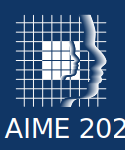

# Radiotherapy Dose Optimization via Clinical Knowledge Based Reinforcement Learning

## Abstract:
A radiation therapy plan finds an equilibrium between goals with no universal prioritization.
The delicate balance between multiple objectives is typically done manually.
The optimization process is further hindered by complex mathematical aspects, involving non-convex multi-objective inverse problems with a vast solution space.
Expert bias introduces variability in clinical practice, as the preferences of radiation oncologists and medical physicists shape treatment planning.
To surmount these challenges, we propose a first step towards a fully automated approach, using an innovative deep-learning framework.
Using a clinically meaningful distance between doses, we trained a reinforcement learning agent to mimic a set of plans.
This method allows automatic navigation toward acceptable solutions via the exploitation of optimal dose distributions found by
human planners on previously treated patients.
As this is ongoing research, we generated synthetic phantom patients and associated realistic clinical doses.
Our deep learning agent successfully learned correct actions leading to treatment plans similar to past cases ones.
The incapacity to reproduce human-like dose plans hinders adopting a fully automated treatment planning system; this method could start paving the way towards human-less treatment planning system technologies.
In future work, we hope to be able to apply this technique to real cases.

